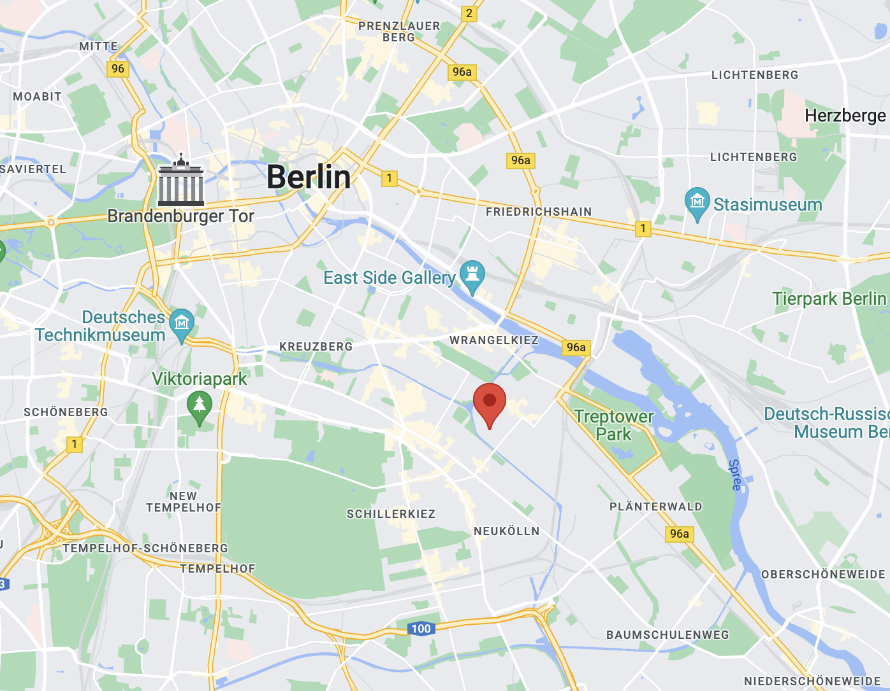
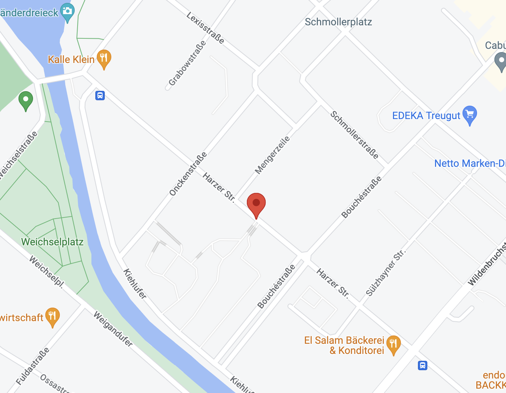
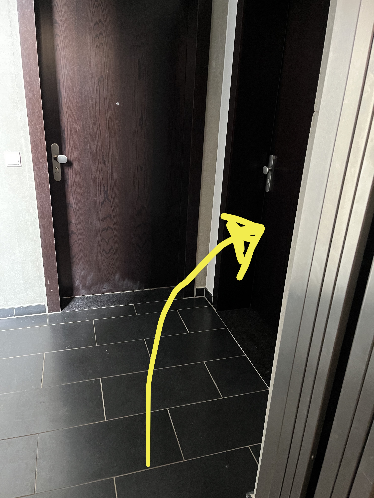

### What
Housewarming. Hot dogs. Light beers and other drinks. Rain or no rain, fuck it.

### When
Saturday, 21st of May. Starting around 1600 aka 4pm. 

### What to bring
We'll have enough food, hopefully. And a decent amount of light beers, but BYOB if you want an extra or something special.

## Where 
Harzer Straβe 107.

   

 
The building

   
Name on door is Lulkin.

 
Apparently it means "pipe" or something.

   
Go in, the first door on the left.

   
Don't fk up.

   
Click the [&#9650; "black up-pointing triangle" icon (unicode 9650)](http://www.amp-what.com/unicode/search/black%20up-pointing%20triangle) and then [5 "digit five" (unicode 53)](http://www.amp-what.com/unicode/search/5). Enjoy the slowest elevetor in the world.

   
Door on the right. You've made it.
